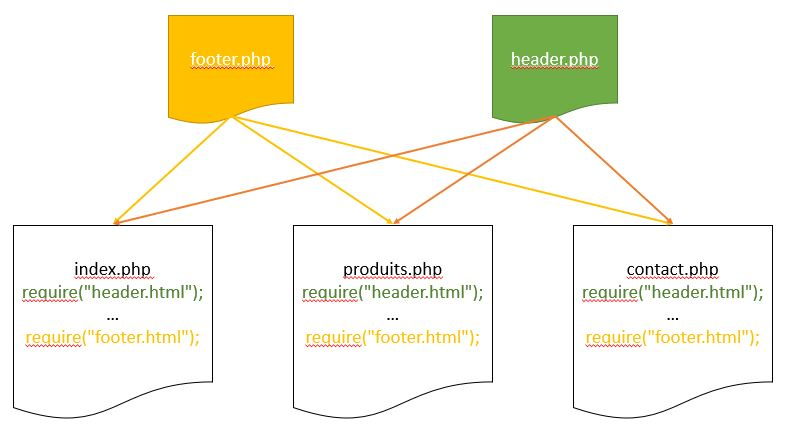
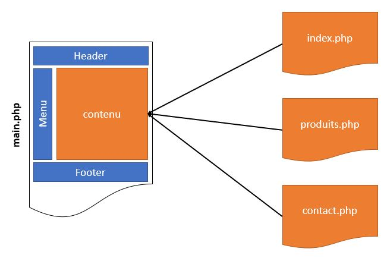
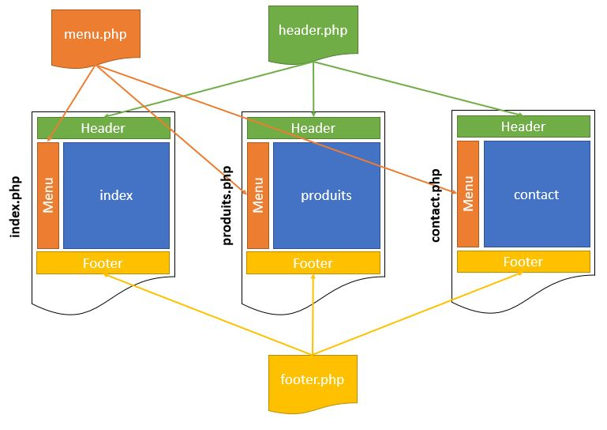

# Les inclusions

Il existe 4 structures de langage en PHP qui sont pratiques pour le développement web :
- `require` : inclut le contenu d'un autre fichier appelé, et provoque une erreur bloquante s'il est indisponible ;
- `require_once` : même chose que `require`, mais ne le fait qu'une seule fois en tout et pour tout dans le même document, si `require` a déjà été appelé auparavant avec le même nom de fichier ;
- `include` : inclut le contenu d'un autre fichier appelé, mais ne provoque pas d'erreur bloquante s'il est indisponible ;
- `include_once` : même chose que `include`, mais ne le fait qu'une seule fois en tout et pour tout dans le même document si une inclusion a déjà été appelée auparavant avec le même nom de fichier.

L'intérêt est de pouvoir "inclure" automatiquement des fichiers communs à l'ensemble - ou à une partie spécifique - du site. Il s'agit souvent de code HTML mais cela fonctionne avec tout ce qui est texte. 

Bien souvent on s'arrête à `include`, mais sa variante `include_once` est bien pratique pour ne pas répéter une inclusion plusieurs fois par inadvertance (par exemple avec du code PHP plus complexe). De même, `require` est très intéressant pour "protéger" le fonctionnement d'une page ou application web : si le fichier nécessaire n'est pas accessible alors une erreur sera déclenchée et PHP arrêtera la production du document plutôt que de servir un code HTML incomplet et incohérent.

## Utilisation

L'un des cas les plus évident d'utilisation est la production de code qui est partagé entre plusieurs fichiers d'un site : 
- En-tête de page
- Pied de page
- Menu de navigation
- Barre contextuelle
- Paramètres communs PHP (par exemple connexion à MySQL, variables de configuration, chaînes de texte, fonctions...) 

Le code commun est aussi bien de l'affichage que du code à exécuter.

Ceci présente nettement plus d'intérêt quand plusieurs fichiers font appel aux mêmes ressources.

L’utilisation d’un include ou d'un require revient à faire un simple copier-coller : le code du fichier appelé est inséré à l’intérieur de la page appelante, à l’endroit exact où se trouve la fonction. Elle peut être placée n’importe où, à l’intérieur du code source HTML : entre les balises <head> et </head> ou <body> et </body>, par exemple.

## Exemple

@[Exemple include]({"stubs": ["main.php","include.php"], "command": "/bin/bash run.sh main.php"})

L'exemple ci-dessus comprend la page `main.php`, celle-ci inclut la page `include.php`. Lors de l'exécution la page `include.php` sera ajoutée à la page `main.php` à l'emplacement de l'inclusion. Le résultat final est une seule page affichant l'intégralité des pages après interprétation.

## Possibilités

Il y a deux possibilités principales d'utiliser les inclusions pour constuire un site.

|Représentation|Explication|
|--------------|-----------|
||La page main.php contient les en-tête, pied de page et menu. Le contenu principal des pages est inclu dans cette page principale.|
||Une page par contenu principal est construite. Chaque page inclut les pages header.php, footer.php et menu.php.|
